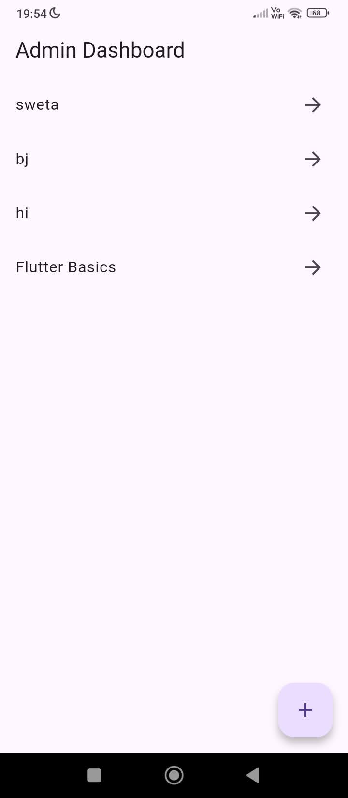
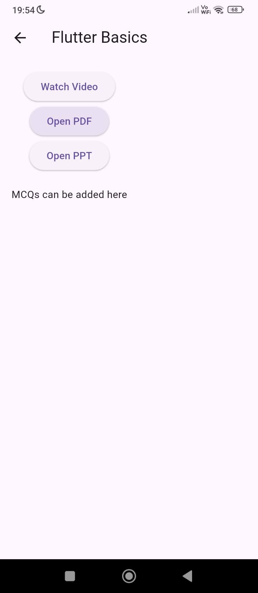

# edulearn

**EduLearn** is a mobile learning application developed using **Flutter** and **Firebase** as part of an academic assignment.  
The app provides role-based access for **Admin** and **Students**, allowing students to access free learning content after Google authentication.

## 🛠️ Technologies Used

- **Flutter** – Frontend framework
- **Firebase Authentication** – Google Sign-In
- **Cloud Firestore** – Database
- **Firebase Hosting** – Backend services
- **Android SDK** – APK generation

## 🔐 Authentication Flow

- Users log in using **Google Sign-In**
- Admin access is identified using a fixed admin email (swetajhaxx@gmail.com)
- Other users are treated as students

## 🧑‍💼 Admin Portal

Admin can:
- Add new courses
- Upload:
    - Video links (YouTube)
    - PDF links
    - PPT links
- Manage course content stored in Firestore

## 🎓 Student Dashboard

Students can:
- View all available courses
- Access:
    - Video lectures
    - PDFs
    - PPTs
    - MCQs
- View student profile details

## 📸 Application Screenshots

### 🔹 Google Authentication

### 🔹 Admin Dashboard

### 🔹 Course Added by Admin

### 🔹 Course Details (Student View)

